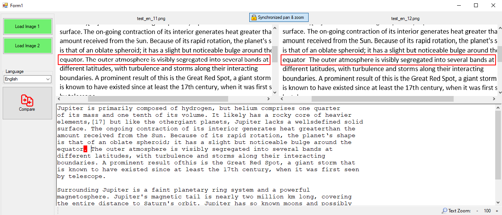

# OCR Text Comparer
Allows user to select two image files. Then after pressing 'Compare' button texts from two images are compared and differences highlighted.

## How it works
Texts are extracted from both images using Tesseract ocr engine. These texts are then compared using google's diff-match-path algo. Result is put into text box below images. When user clicks on line in text box, this line is highlighted (+ pan & zoom) in both original images allowing quick peek.

Quality of results are highly dependent on quality of ocr. For best results use images with at least 400 DPI (600 DPI and more is optimal).

## Code organization

## Dependencies
 - .NET Framework 4
 - Nuget packages:
   - EmguCV
   - Magick.NET-Q8-AnyCPU
   - OpenTK
   - OpenTK.GLControl
   - Tesseract
   - ZedGraph

